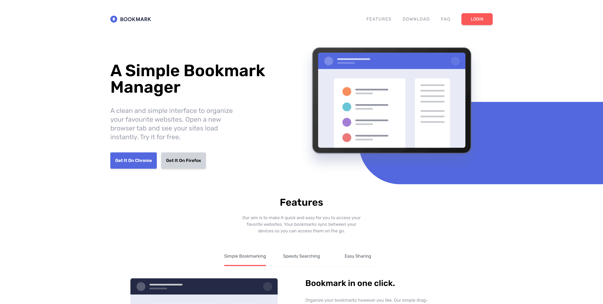

# bookmarkTraining

This README provides an overview of the `index.html` file for the bookmarkTraining project, focusing on the Tailwind CSS classes and functionality used throughout the document. The file is structured into several key sections, each utilizing various Tailwind utilities to create a responsive and visually appealing layout.

## Table of Contents
1. [Header Section](#header-section)
2. [Hero Section](#hero-section)
3. [Features Section](#features-section)
4. [Download Section](#download-section)
5. [FAQ Section](#faq-section)
6. [Newsletter Section](#newsletter-section)
7. [Footer Section](#footer-section)

## Header Section

The header serves as the navigation bar for the website, allowing users to access different sections seamlessly.

### Key Tailwind Classes:
- **Container**: `container relative mx-auto p-6` - Centers the navigation bar and adds padding.
- **Flex Utilities**: `flex items-center justify-between` - Aligns navigation items horizontally with space between.
- **Responsive Visibility**: `hidden md:flex` - Hides the menu on mobile devices and displays it on larger screens.

## Hero Section

The hero section introduces the Bookmark Manager with a catchy headline and description.

### Key Tailwind Classes:
- **Layout**: `flex flex-col-reverse lg:flex-row` - Adjusts the layout direction based on screen size for optimal viewing.
- **Text Styling**: `text-3xl font-semibold lg:text-6xl` - Emphasizes the main heading with different sizes for mobile and desktop.
- **Button Styles**: `p-4 text-sm font-semibold text-white bg-softBlue rounded shadow-md` - Styles the call-to-action buttons with color and padding.

## Features Section

This section outlines the main features of the Bookmark Manager.

### Key Tailwind Classes:
- **Text Centering**: `text-center` - Centers the feature headings and descriptions.
- **Margin Utilities**: `mx-auto` - Centers content horizontally within the section.
- **Background Color**: `bg-gray-100` - Provides a light background to enhance readability and visual separation.

## Download Section

The download section encourages users to add the browser extension, highlighting compatibility with different browsers.

### Key Tailwind Classes:
- **Flex Layout**: `flex flex-col md:flex-row` - Creates a responsive layout for download boxes.
- **Spacing**: `space-y-10 md:space-y-0 md:space-x-7` - Applies vertical spacing for mobile and horizontal spacing for larger screens.
- **Card Styling**: `rounded-lg shadow-lg` - Adds rounded corners and shadow to each download box for a card-like appearance.

## FAQ Section

This section addresses frequently asked questions about the Bookmark Manager.

### Key Tailwind Classes:
- **Container**: `max-w-2xl mx-auto` - Centers the FAQ content with a maximum width for better readability.
- **Border and Padding**: `border-b py-1` - Styles each question with bottom borders and vertical padding.
- **Text Transition**: `transition duration-500` - Smoothens the appearance of the accordion for better user experience.

## Newsletter Section

The newsletter section allows users to sign up for updates and news.

### Key Tailwind Classes:
- **Background Color**: `bg-softBlue text-white` - Sets a distinct background color to stand out from other sections.
- **Flex Utilities**: `flex flex-col md:flex-row` - Arranges input and button elements responsively.
- **Button Styles**: `bg-softRed hover:opacity-90` - Styles the submit button with a hover effect for interactivity.

## Footer Section

The footer wraps up the website, providing additional links and social media icons.

### Key Tailwind Classes:
- **Background Color**: `bg-veryDarkBlue` - Creates a dark contrast to separate the footer from the main content.
- **Flex Layout**: `flex flex-col md:flex-row` - Organizes footer elements responsively, with a column layout on mobile and row layout on larger screens.
- **Text Color**: `text-grayishBlue` - Applies a lighter color to footer text for readability against the dark background.
