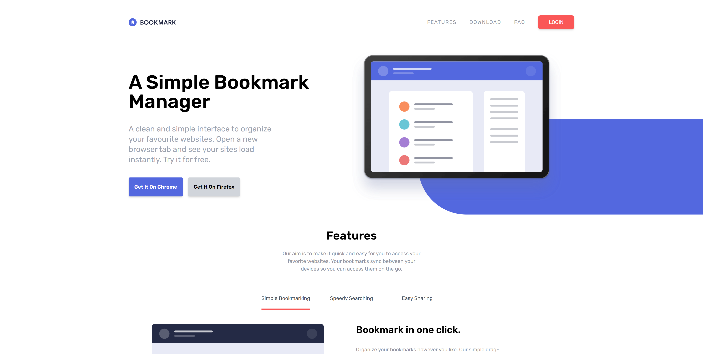

# bookmarkTraining

Este README fornece uma visão geral do arquivo `index.html` para o projeto bookmarkTraining, focando nas classes Tailwind CSS e na funcionalidade usadas ao longo do documento. O arquivo é estruturado em várias seções principais, cada uma utilizando várias utilidades do Tailwind para criar um layout responsivo e visualmente atraente.

## Tabela de Conteúdos
1. [Header Section](#header-section)
2. [Hero Section](#hero-section)
3. [Features Section](#features-section)
4. [Download Section](#download-section)
5. [FAQ Section](#faq-section)
6. [Newsletter Section](#newsletter-section)
7. [Footer Section](#footer-section)

## Header Section

O cabeçalho serve como a barra de navegação para o site, permitindo que os usuários acessem diferentes seções de forma tranquila.

### Principais Classes Tailwind:
- **Container**: `container relative mx-auto p-6` - Centraliza a barra de navegação e adiciona padding.
- **Utilitários Flex**: `flex items-center justify-between` - Alinha os itens de navegação horizontalmente com espaço entre eles.
- **Visibilidade Responsiva**: `hidden md:flex` - Esconde o menu em dispositivos móveis e o exibe em telas maiores.

## Hero Section

A seção hero introduz o Bookmark Manager com um título atraente e uma descrição.

### Principais Classes Tailwind:
- **Layout**: `flex flex-col-reverse lg:flex-row` - Ajusta a direção do layout com base no tamanho da tela para uma visualização ideal.
- **Estilização de Texto**: `text-3xl font-semibold lg:text-6xl` - Enfatiza o título principal com tamanhos diferentes para mobile e desktop.
- **Estilos de Botão**: `p-4 text-sm font-semibold text-white bg-softBlue rounded shadow-md` - Estiliza os botões de chamada à ação com cor e padding.

## Features Section

Esta seção descreve as principais funcionalidades do Bookmark Manager.

### Principais Classes Tailwind:
- **Centralização de Texto**: `text-center` - Centraliza os títulos e descrições das funcionalidades.
- **Utilitários de Margem**: `mx-auto` - Centraliza o conteúdo horizontalmente dentro da seção.
- **Cor de Fundo**: `bg-gray-100` - Fornece um fundo claro para melhorar a legibilidade e a separação visual.

## Download Section

A seção de download incentiva os usuários a adicionar a extensão do navegador, destacando a compatibilidade com diferentes navegadores.

### Principais Classes Tailwind:
- **Layout Flexível**: `flex flex-col md:flex-row` - Cria um layout responsivo para as caixas de download.
- **Espaçamento**: `space-y-10 md:space-y-0 md:space-x-7` - Aplica espaçamento vertical para mobile e espaçamento horizontal para telas maiores.
- **Estilização de Cartão**: `rounded-lg shadow-lg` - Adiciona cantos arredondados e sombra a cada caixa de download para uma aparência de cartão.

## FAQ Section

Esta seção aborda perguntas frequentes sobre o Bookmark Manager.

### Principais Classes Tailwind:
- **Container**: `max-w-2xl mx-auto` - Centraliza o conteúdo de FAQ com uma largura máxima para melhor legibilidade.
- **Borda e Padding**: `border-b py-1` - Estiliza cada pergunta com bordas inferiores e padding vertical.
- **Transição de Texto**: `transition duration-500` - Suaviza a aparência do acordeão para uma melhor experiência do usuário.

## Newsletter Section

A seção de newsletter permite que os usuários se inscrevam para receber atualizações e notícias.

### Principais Classes Tailwind:
- **Cor de Fundo**: `bg-softBlue text-white` - Define uma cor de fundo distinta para se destacar de outras seções.
- **Utilitários Flex**: `flex flex-col md:flex-row` - Organiza os elementos de input e botão responsivamente.
- **Estilos de Botão**: `bg-softRed hover:opacity-90` - Estiliza o botão de envio com um efeito de hover para interatividade.

## Footer Section

O rodapé encerra o site, fornecendo links adicionais e ícones de mídias sociais.

### Principais Classes Tailwind:
- **Cor de Fundo**: `bg-veryDarkBlue` - Cria um contraste escuro para separar o rodapé do conteúdo principal.
- **Layout Flexível**: `flex flex-col md:flex-row` - Organiza os elementos do rodapé responsivamente, com um layout em coluna em mobile e em linha em telas maiores.
- **Cor do Texto**: `text-grayishBlue` - Aplica uma cor mais clara ao texto do rodapé para legibilidade contra o fundo escuro.
